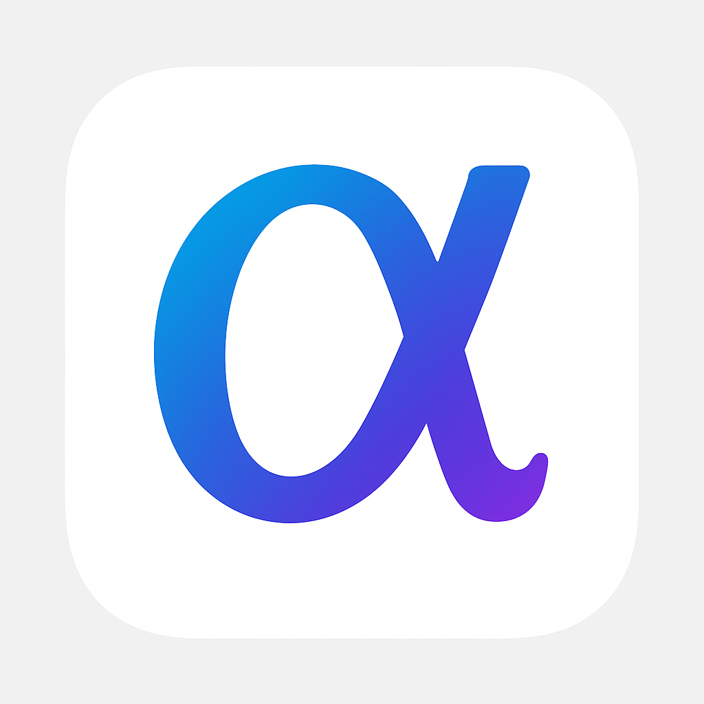

# Alpha Social - 去中心化社交网络



## 项目概述

Alpha Social 是一个基于自主开发区块链网络的去中心化社交平台，旨在为用户提供真正的数据所有权、隐私保护和言论自由。通过区块链技术，Alpha Social 实现了完全去中心化的社交网络，用户可以在不受任何中心化机构控制的环境中进行社交互动。

### 核心特性

- **完全去中心化**: 基于自主开发的Alpha区块链网络
- **跨平台支持**: Web、移动端(PWA)、桌面端应用
- **原生代币**: AlphaCoin (ALC) 作为平台流通代币
- **多媒体支持**: 文字、图片、视频内容发布
- **隐私保护**: 端到端加密的私聊功能
- **社区治理**: 基于代币的去中心化治理机制
- **激励机制**: 内容创作和社区参与奖励

### 技术架构

```
┌─────────────────────────────────────────────────────────────┐
│                    Alpha Social 架构图                      │
├─────────────────────────────────────────────────────────────┤
│  前端应用层                                                  │
│  ┌─────────────┐ ┌─────────────┐ ┌─────────────┐           │
│  │   Web App   │ │ Mobile PWA  │ │ Desktop App │           │
│  │  (React)    │ │  (React)    │ │ (Electron)  │           │
│  └─────────────┘ └─────────────┘ └─────────────┘           │
├─────────────────────────────────────────────────────────────┤
│  API服务层                                                   │
│  ┌─────────────────────────────────────────────────────────┐ │
│  │              Alpha Social API (Flask)                  │ │
│  │  用户管理 | 内容管理 | 社交关系 | 代币交易               │ │
│  └─────────────────────────────────────────────────────────┘ │
├─────────────────────────────────────────────────────────────┤
│  区块链层                                                    │
│  ┌─────────────────────────────────────────────────────────┐ │
│  │                Alpha Blockchain                         │ │
│  │  ┌─────────────┐ ┌─────────────┐ ┌─────────────┐       │ │
│  │  │ AlphaCoin   │ │ AlphaSocial │ │ UserIdentity│       │ │
│  │  │   Pallet    │ │   Pallet    │ │   Pallet    │       │ │
│  │  └─────────────┘ └─────────────┘ └─────────────┘       │ │
│  └─────────────────────────────────────────────────────────┘ │
├─────────────────────────────────────────────────────────────┤
│  基础设施层                                                  │
│  ┌─────────────┐ ┌─────────────┐ ┌─────────────┐           │
│  │   P2P网络   │ │   共识机制   │ │   存储层    │           │
│  │  (libp2p)   │ │   (AURA)    │ │  (RocksDB)  │           │
│  └─────────────┘ └─────────────┘ └─────────────┘           │
└─────────────────────────────────────────────────────────────┘
```

## 快速开始

### 环境要求

- **操作系统**: Ubuntu 22.04+ / macOS 12+ / Windows 10+
- **Rust**: 1.70+
- **Node.js**: 18+
- **Python**: 3.11+
- **Docker**: 20.10+ (可选)

### 安装部署

#### 1. 克隆项目

```bash
git clone https://github.com/alpha-team/alpha-blockchain.git
cd alpha-blockchain
```

#### 2. 使用Docker部署 (推荐)

```bash
# 构建并启动整个网络
docker-compose up -d

# 查看服务状态
docker-compose ps

# 查看日志
docker-compose logs -f
```

#### 3. 手动部署

```bash
# 部署区块链网络
./deploy.sh testnet

# 启动API服务
cd alpha-social-api
python src/main.py &

# 启动前端应用
cd ../alpha-social-frontend
pnpm run dev &
```

### 访问应用

- **Web应用**: http://localhost:3000
- **API文档**: http://localhost:5000/api
- **区块浏览器**: http://localhost:3002
- **监控面板**: http://localhost:3001

## 项目结构

```
alpha-blockchain/
├── README.md                    # 项目说明
├── deploy.sh                    # 部署脚本
├── test-suite.sh               # 测试套件
├── docker-compose.yml          # Docker编排
├── genesis.json                # 创世区块配置
├── tokenomics.md              # 代币经济学
├── docs/                      # 项目文档
│   ├── README.md              # 主文档
│   ├── technical-guide.md     # 技术指南
│   ├── user-manual.md         # 用户手册
│   ├── deployment-guide.md    # 部署指南
│   └── maintenance-plan.md    # 维护计划
├── runtime/                   # 区块链运行时
│   ├── src/lib.rs            # 运行时配置
│   └── Cargo.toml            # 依赖配置
├── pallets/                   # 自定义模块
│   ├── alpha-coin/           # 代币模块
│   └── alpha-social/         # 社交模块
├── node/                     # 区块链节点
│   ├── src/main.rs          # 节点入口
│   └── Cargo.toml           # 依赖配置
├── alpha-social-api/         # 后端API服务
│   ├── src/                 # 源代码
│   ├── requirements.txt     # Python依赖
│   └── README.md           # API文档
├── alpha-social-frontend/    # 前端Web应用
│   ├── src/                 # 源代码
│   ├── public/              # 静态资源
│   ├── package.json         # 依赖配置
│   └── README.md           # 前端文档
└── alpha-social-desktop/     # 桌面应用
    ├── main.js              # Electron主进程
    ├── package.json         # 依赖配置
    └── README.md           # 桌面应用文档
```

## 核心功能

### 1. 用户身份管理

- 基于区块链的去中心化身份系统
- 支持多种身份验证方式
- 用户数据完全由用户控制

### 2. 内容发布与管理

- 支持文字、图片、视频等多媒体内容
- 内容哈希存储，确保不可篡改
- 分布式内容存储网络

### 3. 社交互动

- 关注/粉丝系统
- 点赞、评论、分享功能
- 群组和社区功能

### 4. 私聊系统

- 端到端加密通信
- 消息不可追踪
- 支持多媒体消息

### 5. 代币经济

- AlphaCoin (ALC) 原生代币
- 内容创作奖励机制
- 社区治理投票权

### 6. 去中心化治理

- 基于代币的投票系统
- 社区提案机制
- 透明的决策过程

## 代币经济学

### AlphaCoin (ALC) 基本信息

- **代币符号**: ALC
- **总供应量**: 1,000,000,000 ALC
- **精度**: 12位小数
- **共识机制**: AURA + GRANDPA

### 代币分配

- **创始团队**: 15% (150,000,000 ALC)
- **早期投资者**: 10% (100,000,000 ALC)
- **社区奖励**: 50% (500,000,000 ALC)
- **生态发展**: 15% (150,000,000 ALC)
- **技术开发**: 10% (100,000,000 ALC)

### 使用场景

1. **内容创作奖励**: 优质内容获得ALC奖励
2. **社交互动**: 点赞、评论消耗少量ALC
3. **治理投票**: 持有ALC参与社区治理
4. **高级功能**: 解锁高级社交功能
5. **广告费用**: 推广内容需要支付ALC

## 技术特性

### 区块链技术

- **框架**: Substrate
- **共识算法**: AURA (出块) + GRANDPA (最终确定)
- **网络协议**: libp2p
- **存储引擎**: RocksDB
- **虚拟机**: WASM

### 前端技术

- **框架**: React 18
- **构建工具**: Vite
- **UI库**: 自定义组件
- **状态管理**: React Hooks
- **PWA支持**: Service Worker

### 后端技术

- **框架**: Flask
- **数据库**: SQLite/PostgreSQL
- **缓存**: Redis (可选)
- **API**: RESTful API
- **认证**: JWT + 区块链签名

### 桌面应用

- **框架**: Electron
- **跨平台**: Windows/macOS/Linux
- **自动更新**: electron-updater
- **原生集成**: 系统通知、文件关联

## 安全特性

### 区块链安全

- **密码学**: Ed25519签名算法
- **网络安全**: TLS加密通信
- **共识安全**: 拜占庭容错
- **数据完整性**: 哈希链保护

### 应用安全

- **身份验证**: 多重签名验证
- **数据加密**: AES-256加密
- **隐私保护**: 零知识证明
- **安全审计**: 定期安全检查

## 性能指标

### 区块链性能

- **出块时间**: 6秒
- **交易吞吐量**: 1000+ TPS
- **最终确定时间**: 12秒
- **存储效率**: 压缩存储

### 应用性能

- **页面加载**: < 2秒
- **API响应**: < 100ms
- **离线支持**: PWA缓存
- **内存使用**: < 100MB

## 路线图

### 第一阶段 (已完成)
- ✅ 区块链核心开发
- ✅ 基础社交功能
- ✅ Web应用开发
- ✅ 移动端PWA
- ✅ 桌面应用

### 第二阶段 (计划中)
- 🔄 主网启动
- 🔄 社区治理
- 🔄 生态合作
- 🔄 移动原生应用

### 第三阶段 (规划中)
- 📋 跨链互操作
- 📋 AI内容推荐
- 📋 NFT集成
- 📋 DeFi功能

## 社区与支持

### 官方渠道

- **官网**: https://alpha-social.com
- **GitHub**: https://github.com/alpha-team/alpha-blockchain
- **文档**: https://docs.alpha-social.com
- **论坛**: https://forum.alpha-social.com

### 社交媒体

- **Twitter**: @AlphaSocialNet
- **Telegram**: @AlphaSocialCommunity
- **Discord**: Alpha Social Community
- **微信群**: 扫码加入

### 技术支持

- **邮箱**: support@alpha-social.com
- **技术文档**: docs/technical-guide.md
- **API文档**: http://localhost:5000/api/docs
- **问题反馈**: GitHub Issues

## 贡献指南

我们欢迎社区贡献！请阅读 [CONTRIBUTING.md](CONTRIBUTING.md) 了解如何参与项目开发。

### 开发流程

1. Fork 项目仓库
2. 创建功能分支
3. 提交代码更改
4. 创建 Pull Request
5. 代码审查和合并

### 代码规范

- **Rust**: 遵循 Rust 官方风格指南
- **JavaScript**: 使用 ESLint + Prettier
- **Python**: 遵循 PEP 8 规范
- **提交信息**: 使用约定式提交格式

## 许可证

本项目采用 MIT 许可证 - 详见 [LICENSE](LICENSE) 文件。

## 致谢

感谢所有为 Alpha Social 项目做出贡献的开发者、设计师和社区成员。

---

**Alpha Social - 重新定义社交网络的未来**

