# Alpha Social 维护计划

## 概述

本文档详细说明了Alpha Social区块链网络和相关应用的长期维护策略，包括日常运维、定期维护、升级计划、安全管理等方面。

## 维护团队结构

### 核心团队角色

#### 技术负责人 (Tech Lead)
- **职责**: 技术决策、架构演进、团队管理
- **技能要求**: 区块链技术、系统架构、团队领导
- **工作时间**: 全职
- **联系方式**: tech-lead@alpha-social.com

#### 区块链工程师 (Blockchain Engineer)
- **职责**: 区块链开发、节点维护、共识机制优化
- **技能要求**: Rust、Substrate、密码学
- **工作时间**: 全职
- **联系方式**: blockchain@alpha-social.com

#### 后端工程师 (Backend Engineer)
- **职责**: API开发、数据库管理、性能优化
- **技能要求**: Python、Flask、PostgreSQL、Redis
- **工作时间**: 全职
- **联系方式**: backend@alpha-social.com

#### 前端工程师 (Frontend Engineer)
- **职责**: 前端开发、用户体验、移动端适配
- **技能要求**: React、JavaScript、PWA、Electron
- **工作时间**: 全职
- **联系方式**: frontend@alpha-social.com

#### DevOps工程师 (DevOps Engineer)
- **职责**: 部署自动化、监控告警、基础设施管理
- **技能要求**: Docker、Kubernetes、监控系统、云服务
- **工作时间**: 全职
- **联系方式**: devops@alpha-social.com

#### 安全工程师 (Security Engineer)
- **职责**: 安全审计、漏洞修复、安全策略制定
- **技能要求**: 网络安全、密码学、渗透测试
- **工作时间**: 兼职/顾问
- **联系方式**: security@alpha-social.com

### 支持团队

#### 社区管理员 (Community Manager)
- **职责**: 社区运营、用户支持、反馈收集
- **技能要求**: 沟通能力、社区运营经验
- **工作时间**: 全职
- **联系方式**: community@alpha-social.com

#### 产品经理 (Product Manager)
- **职责**: 产品规划、需求分析、用户研究
- **技能要求**: 产品设计、用户体验、数据分析
- **工作时间**: 全职
- **联系方式**: product@alpha-social.com

## 日常运维

### 监控检查

#### 每日检查清单
```bash
#!/bin/bash
# daily-check.sh

echo "=== Alpha Social 每日检查 $(date) ==="

# 1. 检查服务状态
echo "1. 检查服务状态..."
services=("alpha-validator-1" "alpha-postgres" "alpha-redis" "alpha-api" "alpha-frontend")
for service in "${services[@]}"; do
    if docker ps | grep -q $service; then
        echo "✓ $service 运行正常"
    else
        echo "✗ $service 未运行 - 需要立即处理"
        # 尝试重启服务
        docker start $service
    fi
done

# 2. 检查区块链同步状态
echo "2. 检查区块链同步状态..."
sync_state=$(curl -s -H "Content-Type: application/json" \
  -d '{"id":1, "jsonrpc":"2.0", "method": "system_syncState", "params":[]}' \
  http://localhost:9933 | jq -r '.result.currentBlock')

if [ "$sync_state" != "null" ]; then
    echo "✓ 区块链同步正常，当前区块: $sync_state"
else
    echo "✗ 区块链同步异常"
fi

# 3. 检查系统资源
echo "3. 检查系统资源..."
disk_usage=$(df / | awk 'NR==2 {print $5}' | sed 's/%//')
memory_usage=$(free | awk 'NR==2{printf "%.0f", $3*100/$2}')
cpu_usage=$(top -bn1 | grep "Cpu(s)" | awk '{print $2}' | sed 's/%us,//')

echo "磁盘使用率: ${disk_usage}%"
echo "内存使用率: ${memory_usage}%"
echo "CPU使用率: ${cpu_usage}%"

# 告警阈值检查
if [ $disk_usage -gt 80 ]; then
    echo "⚠️  磁盘使用率过高: ${disk_usage}%"
fi

if [ $memory_usage -gt 80 ]; then
    echo "⚠️  内存使用率过高: ${memory_usage}%"
fi

# 4. 检查网络连接
echo "4. 检查网络连接..."
peer_count=$(curl -s -H "Content-Type: application/json" \
  -d '{"id":1, "jsonrpc":"2.0", "method": "system_networkState", "params":[]}' \
  http://localhost:9933 | jq -r '.result.connectedPeers | length')

echo "连接的节点数: $peer_count"

if [ $peer_count -lt 3 ]; then
    echo "⚠️  连接的节点数过少: $peer_count"
fi

# 5. 检查API健康状态
echo "5. 检查API健康状态..."
api_health=$(curl -s http://localhost:5000/api/health | jq -r '.status')

if [ "$api_health" = "healthy" ]; then
    echo "✓ API服务健康"
else
    echo "✗ API服务异常"
fi

# 6. 检查数据库连接
echo "6. 检查数据库连接..."
db_status=$(docker exec alpha-postgres psql -U alpha -d alpha_social -c "SELECT 1;" 2>/dev/null)

if [ $? -eq 0 ]; then
    echo "✓ 数据库连接正常"
else
    echo "✗ 数据库连接异常"
fi

echo "=== 每日检查完成 ==="
```

#### 实时监控指标

**区块链指标**
- 区块高度和同步状态
- 交易池大小
- 连接的节点数量
- 验证者在线状态
- 网络延迟

**系统指标**
- CPU使用率 (< 70%)
- 内存使用率 (< 80%)
- 磁盘使用率 (< 80%)
- 网络带宽使用
- 磁盘I/O性能

**应用指标**
- API响应时间 (< 200ms)
- 数据库连接数
- Redis缓存命中率
- 错误率 (< 1%)
- 用户活跃度

### 告警机制

#### 告警级别

**P0 - 紧急 (立即响应)**
- 区块链网络停止出块
- 主要服务完全不可用
- 数据丢失或损坏
- 安全漏洞被利用

**P1 - 高优先级 (1小时内响应)**
- 单个验证者节点离线
- API服务部分功能异常
- 数据库性能严重下降
- 用户无法正常使用核心功能

**P2 - 中优先级 (4小时内响应)**
- 系统资源使用率过高
- 非核心功能异常
- 性能轻微下降
- 监控指标异常

**P3 - 低优先级 (24小时内响应)**
- 文档更新需求
- 功能改进建议
- 非紧急的配置调整

#### 告警通道

```python
# alert_manager.py
import requests
import json
from datetime import datetime

class AlertManager:
    def __init__(self):
        self.slack_webhook = "https://hooks.slack.com/services/YOUR/SLACK/WEBHOOK"
        self.email_api = "https://api.sendgrid.com/v3/mail/send"
        self.pagerduty_api = "https://events.pagerduty.com/v2/enqueue"
    
    def send_alert(self, level, title, message, details=None):
        alert_data = {
            "timestamp": datetime.now().isoformat(),
            "level": level,
            "title": title,
            "message": message,
            "details": details or {}
        }
        
        if level in ["P0", "P1"]:
            self._send_to_pagerduty(alert_data)
            self._send_to_slack(alert_data)
            self._send_email(alert_data)
        elif level == "P2":
            self._send_to_slack(alert_data)
            self._send_email(alert_data)
        else:
            self._send_to_slack(alert_data)
    
    def _send_to_slack(self, alert_data):
        color = {
            "P0": "danger",
            "P1": "warning", 
            "P2": "good",
            "P3": "#439FE0"
        }.get(alert_data["level"], "good")
        
        payload = {
            "attachments": [{
                "color": color,
                "title": f"[{alert_data['level']}] {alert_data['title']}",
                "text": alert_data['message'],
                "timestamp": alert_data['timestamp']
            }]
        }
        
        requests.post(self.slack_webhook, json=payload)
```

### 日志管理

#### 日志收集策略

**应用日志**
```python
# logging_config.py
import logging
import logging.handlers
import json
from datetime import datetime

class JSONFormatter(logging.Formatter):
    def format(self, record):
        log_entry = {
            "timestamp": datetime.utcnow().isoformat(),
            "level": record.levelname,
            "logger": record.name,
            "message": record.getMessage(),
            "module": record.module,
            "function": record.funcName,
            "line": record.lineno
        }
        
        if hasattr(record, 'user_id'):
            log_entry['user_id'] = record.user_id
        
        if hasattr(record, 'request_id'):
            log_entry['request_id'] = record.request_id
            
        return json.dumps(log_entry)

# 配置日志
def setup_logging():
    logger = logging.getLogger('alpha_social')
    logger.setLevel(logging.INFO)
    
    # 文件处理器
    file_handler = logging.handlers.RotatingFileHandler(
        '/var/log/alpha-social/app.log',
        maxBytes=100*1024*1024,  # 100MB
        backupCount=10
    )
    file_handler.setFormatter(JSONFormatter())
    
    # 控制台处理器
    console_handler = logging.StreamHandler()
    console_handler.setFormatter(JSONFormatter())
    
    logger.addHandler(file_handler)
    logger.addHandler(console_handler)
    
    return logger
```

**日志轮转配置**
```bash
# /etc/logrotate.d/alpha-social
/var/log/alpha-social/*.log {
    daily
    missingok
    rotate 30
    compress
    delaycompress
    notifempty
    create 0644 alpha alpha
    postrotate
        docker kill -s USR1 alpha-api
    endscript
}
```

## 定期维护

### 每周维护任务

#### 周一 - 系统更新
```bash
#!/bin/bash
# weekly-system-update.sh

echo "=== 每周系统更新 $(date) ==="

# 1. 系统包更新
echo "1. 更新系统包..."
sudo apt update
sudo apt list --upgradable

# 安全更新
sudo apt upgrade -y

# 2. Docker镜像更新
echo "2. 检查Docker镜像更新..."
docker images --format "table {{.Repository}}\t{{.Tag}}\t{{.CreatedAt}}"

# 拉取最新镜像（如果有新版本）
docker-compose pull

# 3. 清理无用资源
echo "3. 清理系统资源..."
docker system prune -f
docker volume prune -f

# 清理日志文件
find /var/log -name "*.log.*.gz" -mtime +30 -delete

# 4. 检查磁盘空间
echo "4. 磁盘空间报告..."
df -h
du -sh /data/* | sort -hr

echo "=== 系统更新完成 ==="
```

#### 周三 - 性能分析
```bash
#!/bin/bash
# weekly-performance-analysis.sh

echo "=== 每周性能分析 $(date) ==="

# 1. 区块链性能指标
echo "1. 区块链性能指标..."
curl -s -H "Content-Type: application/json" \
  -d '{"id":1, "jsonrpc":"2.0", "method": "system_health", "params":[]}' \
  http://localhost:9933 | jq '.'

# 2. 数据库性能分析
echo "2. 数据库性能分析..."
docker exec alpha-postgres psql -U alpha -d alpha_social -c "
SELECT 
    schemaname,
    tablename,
    attname,
    n_distinct,
    correlation
FROM pg_stats 
WHERE schemaname = 'public'
ORDER BY n_distinct DESC
LIMIT 10;"

# 3. API性能统计
echo "3. API性能统计..."
# 分析Nginx访问日志
awk '{print $7}' /var/log/nginx/access.log | sort | uniq -c | sort -nr | head -10

# 4. 生成性能报告
python3 /opt/alpha-social/scripts/generate_performance_report.py

echo "=== 性能分析完成 ==="
```

#### 周五 - 安全检查
```bash
#!/bin/bash
# weekly-security-check.sh

echo "=== 每周安全检查 $(date) ==="

# 1. 系统安全更新
echo "1. 检查安全更新..."
sudo apt list --upgradable | grep -i security

# 2. 端口扫描
echo "2. 端口扫描..."
nmap -sS localhost

# 3. 文件权限检查
echo "3. 检查关键文件权限..."
find /opt/alpha-social -type f -perm /o+w -exec ls -l {} \;

# 4. 日志安全分析
echo "4. 分析安全日志..."
grep -i "failed\|error\|unauthorized" /var/log/auth.log | tail -20

# 5. SSL证书检查
echo "5. 检查SSL证书..."
openssl x509 -in /etc/letsencrypt/live/alpha-social.com/cert.pem -text -noout | grep "Not After"

echo "=== 安全检查完成 ==="
```

### 每月维护任务

#### 数据备份验证
```bash
#!/bin/bash
# monthly-backup-verification.sh

echo "=== 每月备份验证 $(date) ==="

# 1. 验证区块链备份
echo "1. 验证区块链备份..."
LATEST_BACKUP=$(ls -t /backup/blockchain/blockchain_backup_*.tar.gz | head -1)
echo "最新备份: $LATEST_BACKUP"

# 创建测试环境验证备份
mkdir -p /tmp/backup_test
tar -xzf $LATEST_BACKUP -C /tmp/backup_test

if [ $? -eq 0 ]; then
    echo "✓ 区块链备份验证成功"
    rm -rf /tmp/backup_test
else
    echo "✗ 区块链备份验证失败"
fi

# 2. 验证数据库备份
echo "2. 验证数据库备份..."
LATEST_DB_BACKUP=$(ls -t /backup/database/postgres_backup_*.sql.gz | head -1)
echo "最新数据库备份: $LATEST_DB_BACKUP"

# 创建测试数据库验证备份
docker exec alpha-postgres createdb -U alpha test_restore
gunzip -c $LATEST_DB_BACKUP | docker exec -i alpha-postgres psql -U alpha -d test_restore

if [ $? -eq 0 ]; then
    echo "✓ 数据库备份验证成功"
    docker exec alpha-postgres dropdb -U alpha test_restore
else
    echo "✗ 数据库备份验证失败"
fi

echo "=== 备份验证完成 ==="
```

#### 容量规划
```python
#!/usr/bin/env python3
# monthly-capacity-planning.py

import psutil
import docker
import json
from datetime import datetime, timedelta

def analyze_growth_trends():
    """分析增长趋势"""
    
    # 1. 磁盘使用增长
    disk_usage = psutil.disk_usage('/')
    print(f"磁盘使用情况:")
    print(f"  总容量: {disk_usage.total / (1024**3):.2f} GB")
    print(f"  已使用: {disk_usage.used / (1024**3):.2f} GB")
    print(f"  可用空间: {disk_usage.free / (1024**3):.2f} GB")
    print(f"  使用率: {disk_usage.used / disk_usage.total * 100:.2f}%")
    
    # 2. 内存使用分析
    memory = psutil.virtual_memory()
    print(f"\n内存使用情况:")
    print(f"  总内存: {memory.total / (1024**3):.2f} GB")
    print(f"  已使用: {memory.used / (1024**3):.2f} GB")
    print(f"  使用率: {memory.percent:.2f}%")
    
    # 3. 区块链数据增长
    client = docker.from_env()
    blockchain_container = client.containers.get('alpha-validator-1')
    
    # 获取数据目录大小
    result = blockchain_container.exec_run('du -sh /data')
    data_size = result.output.decode().split()[0]
    print(f"\n区块链数据大小: {data_size}")
    
    # 4. 预测未来需求
    # 基于历史数据预测（这里简化处理）
    daily_growth_gb = 0.5  # 假设每天增长500MB
    monthly_growth_gb = daily_growth_gb * 30
    
    print(f"\n容量预测:")
    print(f"  预计月增长: {monthly_growth_gb:.2f} GB")
    print(f"  3个月后需求: {(disk_usage.used / (1024**3)) + (monthly_growth_gb * 3):.2f} GB")
    print(f"  6个月后需求: {(disk_usage.used / (1024**3)) + (monthly_growth_gb * 6):.2f} GB")
    
    # 5. 建议
    free_space_months = disk_usage.free / (1024**3) / monthly_growth_gb
    print(f"\n建议:")
    if free_space_months < 3:
        print("  ⚠️  建议立即扩容存储")
    elif free_space_months < 6:
        print("  📋 建议在3个月内规划存储扩容")
    else:
        print("  ✓ 当前存储容量充足")

if __name__ == "__main__":
    analyze_growth_trends()
```

### 季度维护任务

#### 全面安全审计
```bash
#!/bin/bash
# quarterly-security-audit.sh

echo "=== 季度安全审计 $(date) ==="

# 1. 依赖漏洞扫描
echo "1. 扫描依赖漏洞..."

# Rust依赖
cd /opt/alpha-social/alpha-blockchain
cargo audit

# Python依赖
cd /opt/alpha-social/alpha-social-api
pip-audit

# Node.js依赖
cd /opt/alpha-social/alpha-social-frontend
npm audit

# 2. Docker镜像安全扫描
echo "2. Docker镜像安全扫描..."
docker run --rm -v /var/run/docker.sock:/var/run/docker.sock \
  aquasec/trivy image alpha-blockchain:latest

# 3. 网络安全扫描
echo "3. 网络安全扫描..."
nmap -sS -O alpha-social.com

# 4. 配置安全检查
echo "4. 配置安全检查..."
# 检查SSH配置
sshd -T | grep -E "(PermitRootLogin|PasswordAuthentication|PubkeyAuthentication)"

# 检查防火墙规则
sudo ufw status verbose

# 5. 生成安全报告
python3 /opt/alpha-social/scripts/generate_security_report.py

echo "=== 安全审计完成 ==="
```

#### 性能基准测试
```python
#!/usr/bin/env python3
# quarterly-benchmark.py

import time
import requests
import statistics
import concurrent.futures
from datetime import datetime

class PerformanceBenchmark:
    def __init__(self):
        self.api_base = "http://localhost:5000/api"
        self.results = {}
    
    def benchmark_api_endpoints(self):
        """API端点性能测试"""
        endpoints = [
            "/health",
            "/users/profile/alice",
            "/content/feed?limit=20",
        ]
        
        for endpoint in endpoints:
            print(f"测试端点: {endpoint}")
            response_times = []
            
            for i in range(100):
                start_time = time.time()
                try:
                    response = requests.get(f"{self.api_base}{endpoint}", timeout=5)
                    end_time = time.time()
                    
                    if response.status_code == 200:
                        response_times.append((end_time - start_time) * 1000)
                except Exception as e:
                    print(f"请求失败: {e}")
            
            if response_times:
                avg_time = statistics.mean(response_times)
                p95_time = statistics.quantiles(response_times, n=20)[18]  # 95th percentile
                
                self.results[endpoint] = {
                    "avg_response_time": avg_time,
                    "p95_response_time": p95_time,
                    "success_rate": len(response_times) / 100
                }
                
                print(f"  平均响应时间: {avg_time:.2f}ms")
                print(f"  95%响应时间: {p95_time:.2f}ms")
                print(f"  成功率: {len(response_times)/100*100:.1f}%")
    
    def benchmark_concurrent_load(self):
        """并发负载测试"""
        print("并发负载测试...")
        
        def make_request():
            try:
                response = requests.get(f"{self.api_base}/health", timeout=5)
                return response.status_code == 200
            except:
                return False
        
        # 测试不同并发级别
        for concurrency in [10, 50, 100]:
            print(f"  并发数: {concurrency}")
            
            with concurrent.futures.ThreadPoolExecutor(max_workers=concurrency) as executor:
                start_time = time.time()
                futures = [executor.submit(make_request) for _ in range(concurrency * 10)]
                results = [future.result() for future in concurrent.futures.as_completed(futures)]
                end_time = time.time()
                
                success_count = sum(results)
                total_time = end_time - start_time
                rps = len(results) / total_time
                
                print(f"    成功请求: {success_count}/{len(results)}")
                print(f"    RPS: {rps:.2f}")
                print(f"    总耗时: {total_time:.2f}s")
    
    def generate_report(self):
        """生成性能报告"""
        report = {
            "timestamp": datetime.now().isoformat(),
            "benchmark_results": self.results
        }
        
        with open(f"/var/log/alpha-social/benchmark_{datetime.now().strftime('%Y%m%d')}.json", "w") as f:
            import json
            json.dump(report, f, indent=2)
        
        print("性能报告已生成")

if __name__ == "__main__":
    benchmark = PerformanceBenchmark()
    benchmark.benchmark_api_endpoints()
    benchmark.benchmark_concurrent_load()
    benchmark.generate_report()
```

## 升级策略

### 版本发布流程

#### 1. 开发阶段

```mermaid
graph LR
    A[功能开发] --> B[代码审查]
    B --> C[单元测试]
    C --> D[集成测试]
    D --> E[安全审计]
    E --> F[性能测试]
    F --> G[发布候选]
```


#### 2. 测试网部署
```bash
#!/bin/bash
# deploy-testnet.sh

echo "=== 部署到测试网 ==="

# 1. 构建新版本
git checkout release/v2.1.0
docker build -t alpha-blockchain:v2.1.0 .

# 2. 部署到测试环境
docker-compose -f docker-compose.testnet.yml down
docker-compose -f docker-compose.testnet.yml up -d

# 3. 运行自动化测试
python3 /opt/alpha-social/tests/integration_tests.py --env testnet

# 4. 性能基准测试
python3 /opt/alpha-social/scripts/benchmark.py --env testnet

echo "=== 测试网部署完成 ==="
```

#### 3. 主网升级
```bash
#!/bin/bash
# mainnet-upgrade.sh

VERSION=$1
if [ -z "$VERSION" ]; then
    echo "Usage: $0 <version>"
    exit 1
fi

echo "=== 主网升级到 $VERSION ==="

# 1. 预升级检查
echo "1. 预升级检查..."
./scripts/pre-upgrade-check.sh

# 2. 备份数据
echo "2. 备份数据..."
./scripts/backup-all.sh

# 3. 蓝绿部署
echo "3. 开始蓝绿部署..."

# 启动新版本（绿色环境）
docker-compose -f docker-compose.green.yml up -d

# 等待服务就绪
sleep 60

# 健康检查
if ./scripts/health-check.sh green; then
    echo "新版本健康检查通过"
    
    # 切换流量
    ./scripts/switch-traffic.sh green
    
    # 停止旧版本
    docker-compose -f docker-compose.blue.yml down
    
    echo "升级成功完成"
else
    echo "新版本健康检查失败，回滚"
    docker-compose -f docker-compose.green.yml down
    exit 1
fi

echo "=== 主网升级完成 ==="
```

### 回滚策略

#### 自动回滚触发条件
- 健康检查失败
- 错误率超过5%
- 响应时间增加50%以上
- 用户投诉激增

#### 回滚执行
```bash
#!/bin/bash
# rollback.sh

echo "=== 执行回滚 ==="

# 1. 立即切换到备用环境
./scripts/switch-traffic.sh blue

# 2. 停止问题版本
docker-compose -f docker-compose.green.yml down

# 3. 恢复数据（如需要）
if [ "$1" = "--restore-data" ]; then
    ./scripts/restore-latest-backup.sh
fi

# 4. 验证回滚
./scripts/health-check.sh blue

echo "=== 回滚完成 ==="
```

## 灾难恢复

### 灾难场景分类

#### 级别1 - 服务中断
- **场景**: 单个服务故障
- **影响**: 部分功能不可用
- **恢复时间**: 15分钟内
- **处理**: 自动重启服务

#### 级别2 - 节点故障
- **场景**: 验证者节点离线
- **影响**: 网络性能下降
- **恢复时间**: 1小时内
- **处理**: 启动备用节点

#### 级别3 - 数据中心故障
- **场景**: 整个数据中心不可用
- **影响**: 服务完全中断
- **恢复时间**: 4小时内
- **处理**: 切换到备用数据中心

#### 级别4 - 数据损坏
- **场景**: 数据库或区块链数据损坏
- **影响**: 数据完整性受损
- **恢复时间**: 24小时内
- **处理**: 从备份恢复数据

### 恢复程序

#### 数据恢复SOP
```bash
#!/bin/bash
# disaster-recovery.sh

DISASTER_LEVEL=$1
BACKUP_DATE=$2

case $DISASTER_LEVEL in
    "1")
        echo "级别1灾难恢复 - 服务重启"
        docker-compose restart
        ;;
    "2")
        echo "级别2灾难恢复 - 节点切换"
        ./scripts/failover-node.sh
        ;;
    "3")
        echo "级别3灾难恢复 - 数据中心切换"
        ./scripts/datacenter-failover.sh
        ;;
    "4")
        echo "级别4灾难恢复 - 数据恢复"
        if [ -z "$BACKUP_DATE" ]; then
            echo "请指定备份日期: $0 4 YYYYMMDD"
            exit 1
        fi
        ./scripts/restore-from-backup.sh $BACKUP_DATE
        ;;
    *)
        echo "未知灾难级别: $DISASTER_LEVEL"
        exit 1
        ;;
esac
```

## 团队协作

### 值班制度

#### 值班安排
- **工作日**: 9:00-18:00 正常工作时间
- **夜间**: 18:00-9:00 值班工程师
- **周末**: 24小时值班工程师
- **节假日**: 24小时值班工程师

#### 值班职责
1. **监控系统状态**: 关注告警和监控指标
2. **处理紧急事件**: 响应P0/P1级别告警
3. **记录问题**: 详细记录问题和处理过程
4. **升级机制**: 无法解决时及时升级

#### 交接流程
```bash
# 值班交接检查清单
echo "=== 值班交接 $(date) ==="

echo "1. 系统状态检查"
./scripts/daily-check.sh

echo "2. 未解决问题"
cat /var/log/alpha-social/pending-issues.log

echo "3. 计划维护任务"
cat /var/log/alpha-social/scheduled-maintenance.log

echo "4. 特殊注意事项"
cat /var/log/alpha-social/special-notes.log

echo "=== 交接完成 ==="
```

### 沟通机制

#### 日常沟通
- **每日站会**: 9:30 AM，15分钟
- **周会**: 每周一 2:00 PM，1小时
- **月度回顾**: 每月最后一个周五 3:00 PM，2小时

#### 紧急沟通
- **P0事件**: 立即电话通知所有相关人员
- **P1事件**: 30分钟内Slack通知
- **P2事件**: 4小时内邮件通知

#### 文档管理
- **技术文档**: Confluence
- **代码文档**: GitHub Wiki
- **运维手册**: GitBook
- **事件记录**: JIRA

### 知识管理

#### 知识库结构
```
Alpha Social 知识库/
├── 技术文档/
│   ├── 架构设计/
│   ├── API文档/
│   ├── 数据库设计/
│   └── 安全规范/
├── 运维手册/
│   ├── 部署指南/
│   ├── 监控告警/
│   ├── 故障处理/
│   └── 维护计划/
├── 最佳实践/
│   ├── 代码规范/
│   ├── 测试策略/
│   ├── 发布流程/
│   └── 安全实践/
└── 事件记录/
    ├── 故障分析/
    ├── 性能优化/
    ├── 安全事件/
    └── 经验总结/
```

#### 知识分享
- **技术分享会**: 每月第二个周五
- **代码审查**: 每个PR必须经过审查
- **文档更新**: 每次变更必须更新文档
- **培训计划**: 新员工入职培训，定期技能提升

## 成本优化

### 资源优化

#### 云服务成本控制
```python
#!/usr/bin/env python3
# cost-optimization.py

import boto3
import json
from datetime import datetime, timedelta

class CostOptimizer:
    def __init__(self):
        self.ec2 = boto3.client('ec2')
        self.cloudwatch = boto3.client('cloudwatch')
    
    def analyze_instance_utilization(self):
        """分析实例使用率"""
        instances = self.ec2.describe_instances()
        
        for reservation in instances['Reservations']:
            for instance in reservation['Instances']:
                instance_id = instance['InstanceId']
                instance_type = instance['InstanceType']
                
                # 获取CPU使用率
                cpu_metrics = self.cloudwatch.get_metric_statistics(
                    Namespace='AWS/EC2',
                    MetricName='CPUUtilization',
                    Dimensions=[{'Name': 'InstanceId', 'Value': instance_id}],
                    StartTime=datetime.utcnow() - timedelta(days=7),
                    EndTime=datetime.utcnow(),
                    Period=3600,
                    Statistics=['Average']
                )
                
                if cpu_metrics['Datapoints']:
                    avg_cpu = sum(dp['Average'] for dp in cpu_metrics['Datapoints']) / len(cpu_metrics['Datapoints'])
                    
                    print(f"实例 {instance_id} ({instance_type}):")
                    print(f"  平均CPU使用率: {avg_cpu:.2f}%")
                    
                    if avg_cpu < 20:
                        print(f"  建议: 考虑降级到更小的实例类型")
                    elif avg_cpu > 80:
                        print(f"  建议: 考虑升级到更大的实例类型")
    
    def recommend_reserved_instances(self):
        """推荐预留实例"""
        # 分析历史使用模式
        # 推荐合适的预留实例配置
        pass
    
    def identify_unused_resources(self):
        """识别未使用的资源"""
        # 查找未使用的EBS卷
        volumes = self.ec2.describe_volumes(
            Filters=[{'Name': 'status', 'Values': ['available']}]
        )
        
        print("未使用的EBS卷:")
        for volume in volumes['Volumes']:
            print(f"  {volume['VolumeId']} - {volume['Size']}GB")

if __name__ == "__main__":
    optimizer = CostOptimizer()
    optimizer.analyze_instance_utilization()
    optimizer.identify_unused_resources()
```

#### 存储优化
```bash
#!/bin/bash
# storage-optimization.sh

echo "=== 存储优化分析 ==="

# 1. 分析磁盘使用
echo "1. 磁盘使用分析..."
du -sh /data/* | sort -hr | head -10

# 2. 查找大文件
echo "2. 查找大文件..."
find /data -type f -size +1G -exec ls -lh {} \; | sort -k5 -hr

# 3. 清理临时文件
echo "3. 清理临时文件..."
find /tmp -type f -mtime +7 -delete
find /var/log -name "*.log.*.gz" -mtime +30 -delete

# 4. 压缩旧数据
echo "4. 压缩旧数据..."
find /data/blockchain -name "*.db" -mtime +90 -exec gzip {} \;

echo "=== 存储优化完成 ==="
```

### 性能成本平衡

#### 自动扩缩容
```yaml
# kubernetes-hpa.yaml
apiVersion: autoscaling/v2
kind: HorizontalPodAutoscaler
metadata:
  name: alpha-api-hpa
spec:
  scaleTargetRef:
    apiVersion: apps/v1
    kind: Deployment
    name: alpha-api
  minReplicas: 2
  maxReplicas: 10
  metrics:
  - type: Resource
    resource:
      name: cpu
      target:
        type: Utilization
        averageUtilization: 70
  - type: Resource
    resource:
      name: memory
      target:
        type: Utilization
        averageUtilization: 80
```

## 总结

本维护计划涵盖了Alpha Social区块链网络的全面维护策略，包括：

1. **日常运维**: 监控、告警、日志管理
2. **定期维护**: 周、月、季度维护任务
3. **升级策略**: 版本发布和回滚流程
4. **灾难恢复**: 多级别灾难恢复方案
5. **团队协作**: 值班制度和沟通机制
6. **成本优化**: 资源优化和成本控制

通过执行这个维护计划，我们可以确保Alpha Social网络的稳定运行、持续改进和长期发展。

---

**联系信息**
- 技术支持: support@alpha-social.com
- 紧急联系: +1-555-ALPHA-911
- 文档更新: docs@alpha-social.com

**最后更新**: 2024年1月1日
**版本**: v1.0
**负责人**: Alpha Social 技术团队

